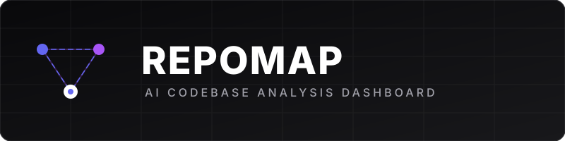
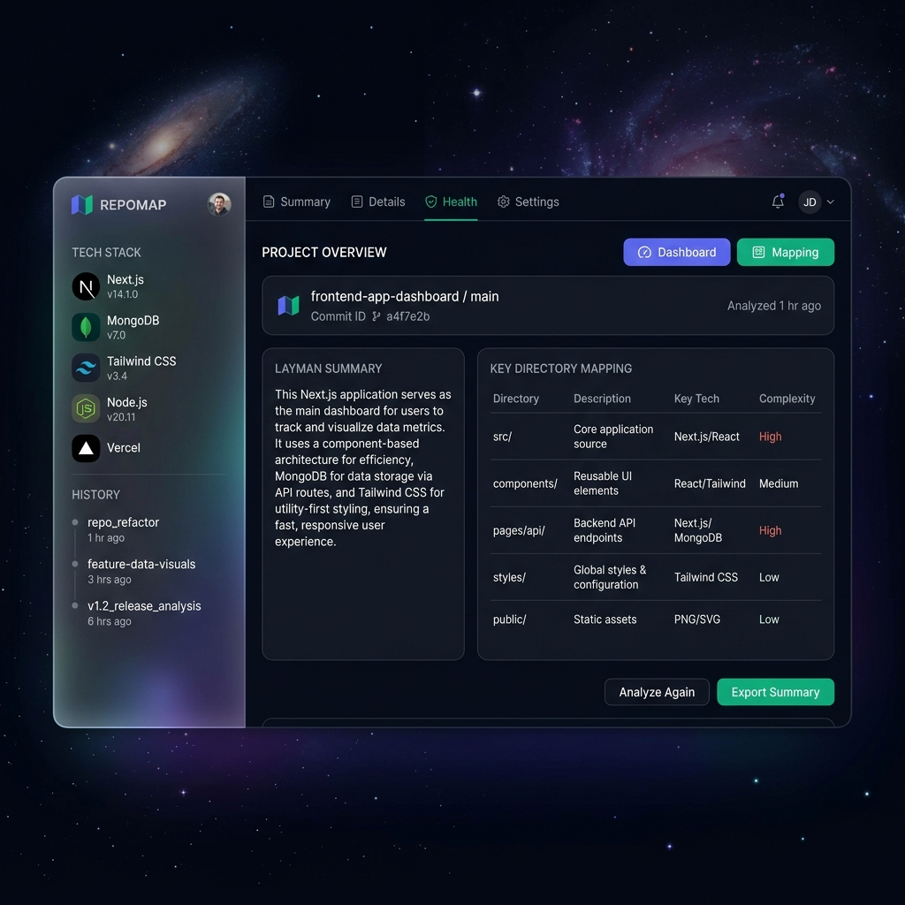
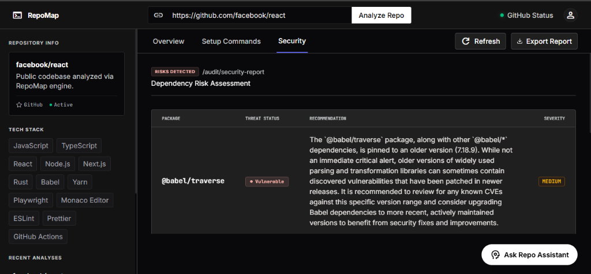
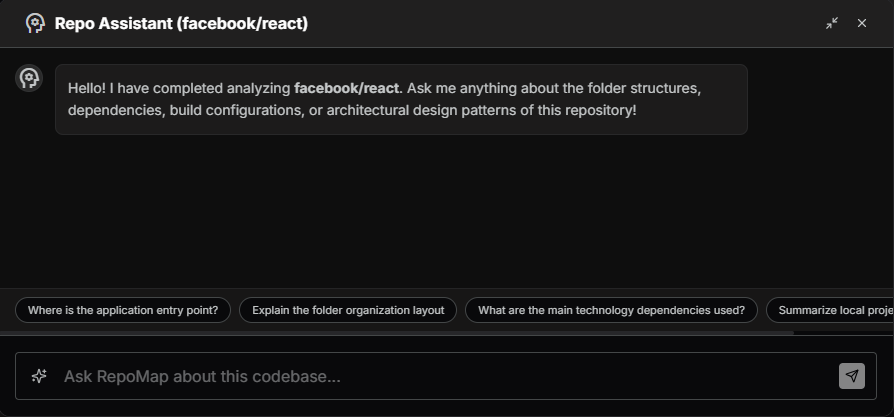
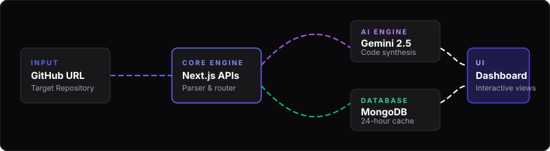

# RepoMap

<div align="center">
  
</div>

<div align="center">


**RepoMap** automatically parses, analyzes, and visualizes any GitHub repository structure, generating premium dark-themed developer dashboards and interactive AI assistance in seconds.

**[Live Deployed URL](https://repomap-ten.vercel.app)**

</div>

---

## App in Action (Screenshots)

Below are the actual screenshots of RepoMap's dark-mode dashboard interfaces in action, highlighting the modern glassmorphism aesthetic and interactive controls.

### 1. Codebase Overview Dashboard
Features the tech stack overview, interactive layman summary, and a directory layout mapping table, all overlaying an animated WebGL star field.


### 2. Dependency Risk Assessment
Audits packages and highlights detected vulnerabilities with description details and severity markers.


### 3. Interactive QA Chat Assistant
An active conversational AI drawer docked to the screen, allowing users to query codebase components, logic, and patterns.


---

## The Real-World Problem and Solution

### The Problem
* **Onboarding friction**: When developers join a new project, they spend hours or days scanning directories, reading package config manifests, and trying to deduce where logic resides and how to compile the environment.
* **Non-technical opacity**: Project managers, clients, or product designers struggle to understand what a codebase actually does or what tech stack it uses since standard documentation is often missing, outdated, or written in overly complex terminology.
* **Hidden security vulnerabilities**: High-risk packages are often left nested in developer dependencies without audits, leaving the project exposed.

### The Solution
**RepoMap** solves this by providing a developer-focused, AI-assisted onboarding portal. By typing in a GitHub repository URL, users immediately get:
1. **Layman Summaries** written in plain, intuitive language for non-technical stakeholders.
2. **Technical Architectural Breakdowns** mapping out design patterns and logic layouts.
3. **Interactive Setup Guides** detailing local environment launch commands.
4. **Security Audits** highlighting outdated or high-risk packages with patch commands.
5. **Interactive AI QA Assistant** to instantly answer developer questions about specific files, functions, or folder paths.

---

## System Architecture and Data Flow

Below is an animated vector flow diagram showing how RepoMap parses data dynamically:

<div align="center">
  
</div>

---

## Features List

* **GitHub Tree Parsing and Manifest Indexing**: Fetch, filter, and parse file structures and root-level configuration manifests via the GitHub REST API.
* **AI-Powered Codebase Synthesis**: Multi-dimensional analysis powered by Google's Gemini API, producing titles, technical stack logs, structured guides, and threat scopes.
* **Dependency Risk Auditing**: Scans parsed manifests to identify high-risk package versions and provides direct terminal commands to patch them.
* **Smart Cache Architecture**: Automatically caches repo analyses inside MongoDB Atlas for 24 hours, ensuring lightning-fast load times.
* **Conversational QA Chat Drawer**: A persistent AI bot equipped with the context of the repository structure to answer queries in markdown format.
* **Multi-Format Export Utilities**: Download full codebase audit reports in PDF, HTML, Markdown (.md), JSON, or Spreadsheet (.csv) configurations.
* **Premium Animated UI**: Curated dark-themed layout built with Tailwind CSS, Outfit fonts, Glassmorphic headers, and an interactive rotating WebGL star field.
* **Smooth Panel Transitions**: Custom CSS cubic-bezier fade-in translate animations designed to transition between content screens seamlessly when tabs are changed.

---

## The AI Architecture and Prompt Engineering

<details>
<summary><b>Click to expand AI System Prompts and Prompts Specifications</b></summary>

RepoMap implements two distinct AI roles using the `gemini-2.5-flash` model.

### 1. Codebase Synthesizer and Architect
This module processes the repository's file tree and configuration manifests to generate a structured analysis payload.

* **Trigger Location**: [lib/gemini.ts:synthesizeRepo](file:///d:/ACTAI%20Final%20Project/lib/gemini.ts#L21-L84)
* **System Instructions / Prompt**:
  ```text
  You are an expert software architect. Analyze codebases and extract setup guides, technology stacks, file layouts, a layman summary of what the codebase does, and potential dependency risks. You must output valid JSON matching the schema strictly.
  ```
* **Payload Structure**:
  ```json
  {
    "projectTitle": "string",
    "techStack": ["string"],
    "laymanSummary": "A summary of what this project does...",
    "architectureSummary": "string",
    "folderBreakdown": [{ "path": "string", "purpose": "string" }],
    "setupSteps": ["string"],
    "securityAlerts": [{ "package": "string", "riskLevel": "low" | "medium" | "high", "recommendation": "string" }]
  }
  ```

### 2. Conversational QA Repo Assistant
This module powers the interactive chat drawer, helping developers find application entry points, understand helper routines, or decipher directory responsibilities.

* **Trigger Location**: [lib/gemini.ts:askRepoAssistant](file:///d:/ACTAI%20Final%20Project/lib/gemini.ts#L86-L131)
* **System Instructions / Prompt**:
  ```text
  Answer developer questions about the repository structures, file paths, logic setup, and configuration layout clearly. Use concise Markdown format, code blocks where appropriate, and cite specific folders or files.
  ```
</details>

---

## Stack, Services and Tools

RepoMap is built using modern cloud solutions and frameworks:

* **Core Framework**: [Next.js 16 (App Router)](https://nextjs.org/) & [React 19](https://react.dev/)
* **Styling**: [Tailwind CSS v4](https://tailwindcss.com/) & [Lucide Icons](https://lucide.dev/)
* **WebGL Graphics**: [OGL](https://github.com/oopsaune/ogl) (Used for the interactive rotating star field)
* **Database**: [MongoDB Atlas](https://www.mongodb.com/atlas/database) & [Mongoose ORM](https://mongoosejs.com/)
* **AI Model Engine**: [Google Gen AI SDK (`@google/genai`)](https://github.com/google/generative-ai-js) using `gemini-2.5-flash`
* **Hosting Platform**: [Vercel](https://vercel.com/)

---

## How to Run locally

<details>
<summary><b>Click to expand Installation and Running Guide</b></summary>

### 1. Clone the repository
```bash
git clone https://github.com/shahrukhfu/RepoMap.git
cd RepoMap
```

### 2. Configure Environment Variables
Create a `.env.local` file at the root level and add the following variables:
```env
# MongoDB Atlas Connection URI
MONGODB_URI=mongodb://your_connection_string

# Google Gemini API Key
GEMINI_API_KEY=your_gemini_api_key

# GitHub Personal Access Token (Used to lift API limits from 60 to 5000 requests/hr)
GITHUB_TOKEN=your_github_token
```

### 3. Install Dependencies
```bash
npm install
```

### 4. Start the Development Server
If your local internet connection is experiencing IPv6 DNS timeout loops when reaching GitHub APIs or MongoDB, launch the server using the IPv4-first flag:

* **On Windows (PowerShell)**:
  ```powershell
  $env:NODE_OPTIONS="--dns-result-order=ipv4first"; npm run dev
  ```
* **On macOS/Linux**:
  ```bash
  NODE_OPTIONS="--dns-result-order=ipv4first" npm run dev
  ```

Open **[http://localhost:3000](http://localhost:3000)** in your browser to view the application.
</details>
